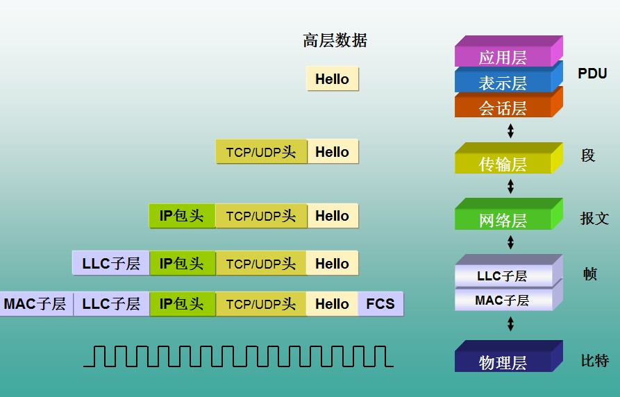
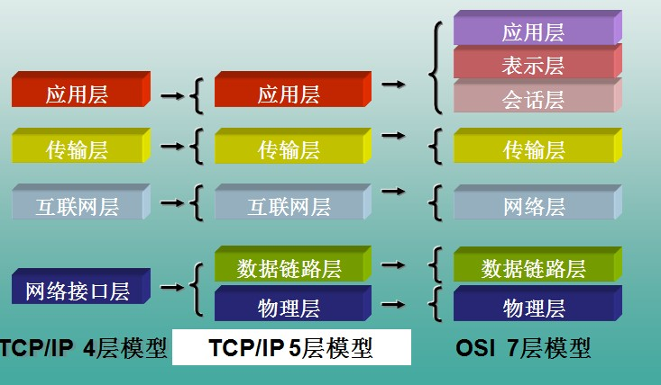
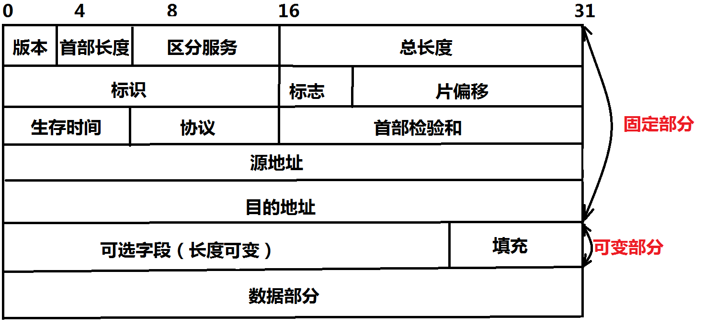
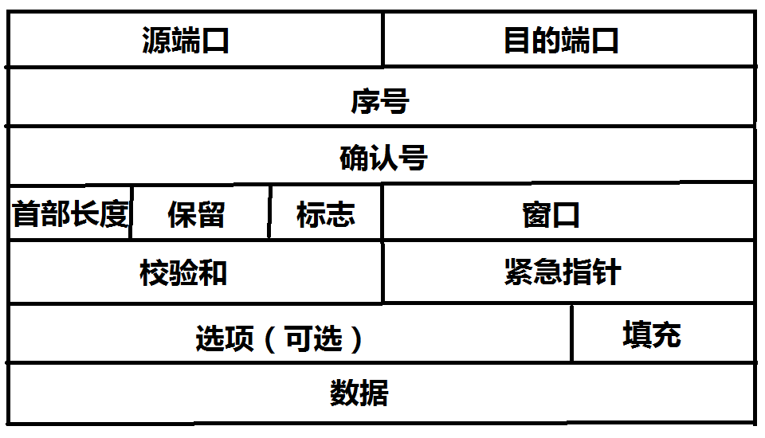
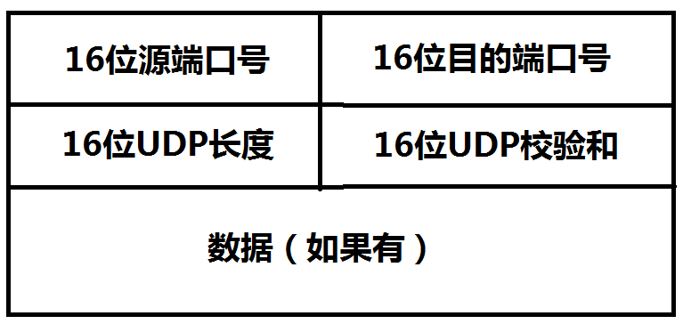

## Python实现网络数据包的捕获
### 一、使用pypcap进行抓取数据包

``` python
import pcap
sniffer = pcap.pcap(name=None, promisc=True, immediate=True)
sniffer.setfilter('ip src host 221.192.237.140')
```
1.导入pypcap包
2.调用pcap.pcap()方法创建一个捕获器sniffer。参数列表如下：
```
- name         -- name of a network interface or dumpfile to open,or None to open the first available up interface
- snaplen      -- maximum number of bytes to capture for each packet
- promisc      -- boolean to specify promiscuous mode sniffing
- timeout_ms   -- requests for the next packet will return None if the timeout (in milliseconds) is reached and no packets were received (Default: no timeout)
- immediate    -- disable buffering, if possible
```

3.调用sniffer的setfilter()方法传入符合BPF格式的数据包过滤字符串创建一个过滤器。BPF格式的说明如下
```
语法：	 |Protocol	|Direction  |Host(s)   |Value  |Logical Operations  |Other expression
例子：	 |tcp	    	|dst        |10.1.1.1  |80     |and                 |tcp dst 10.2.2.2 3128

Protocol（协议）:
可能的值: ether, fddi, ip, arp, rarp, decnet, lat, sca, moprc, mopdl, tcp and udp.
如果没有特别指明是什么协议，则默认使用所有支持的协议。 

Direction（方向）:
可能的值: src, dst, src and dst, src or dst
如果没有特别指明来源或目的地，则默认使用 \"src or dst\" 作为关键字。
例如，\"host 10.2.2.2\"与\"src or dst host 10.2.2.2\"是一样的。 

Host(s):
可能的值： net, port, host, portrange.
如果没有指定此值，则默认使用\"host\"关键字。
例如，\"src 10.1.1.1\"与\"src host 10.1.1.1\"相同。 

Logical Operations（逻辑运算）:
可能的值：not, and, or.
否(\"not\")具有最高的优先级。或(\"or\")和与(\"and\")具有相同的优先级，运算时从左至右进行。
例如，
\"not tcp port 3128 and tcp port 23\"与\"(not tcp port 3128) and tcp port 23\"相同。
\"not tcp port 3128 and tcp port 23\"与\"not (tcp port 3128 and tcp port 23)\"不同。
 

例子：
tcp dst port 3128
显示目的TCP端口为3128的封包。

ip src host 10.1.1.1
显示来源IP地址为10.1.1.1的封包。

host 10.1.2.3
显示目的或来源IP地址为10.1.2.3的封包。

src portrange 2000-2500
显示来源为UDP或TCP，并且端口号在2000至2500范围内的封包。

not imcp
显示除了icmp以外的所有封包。（icmp通常被ping工具使用）

src host 10.7.2.12 and not dst net 10.200.0.0/16
显示来源IP地址为10.7.2.12，但目的地不是10.200.0.0/16的封包。

(src host 10.4.1.12 or src net 10.6.0.0/16) and tcp dst portrange 200-10000 and dst net 10.0.0.0/8
显示来源IP为10.4.1.12或者来源网络为10.6.0.0/16，目的地TCP端口号在200至10000之间，并且目的位于网络10.0.0.0/8内的所有封包。

 
注意事项：
当使用关键字作为值时，需使用反斜杠“\\”。
\"ether proto \\ip\" (与关键字\"ip\"相同).
这样写将会以IP协议作为目标。
\"ip proto \\icmp\" (与关键字\"icmp\"相同).
这样写将会以ping工具常用的icmp作为目标。 
可以在\"ip\"或\"ether\"后面使用\"multicast\"及\"broadcast\"关键字。
当您想排除广播请求时，\"no broadcast\"就会非常有用。
```

### 二、使用dpkt进行解包
在实现之前先导入包：
```python
import dpkt
from dpkt.compat import compat_ord
import datetime
import socket
```
-------
```python
"""
Convert a MAC address to a readable/printable string
       Args:
           address (str): a MAC address in hex form (e.g. '\x01\x02\x03\x04\x05\x06')
       Returns:
           str: Printable/readable MAC address
"""
def mac_addr(address):
    return ':'.join('%02x' % compat_ord(b) for b in address)
```
-------

```python
"""
Convert inet object to a string
        Args:
            inet (inet struct): inet network address
        Returns:
            str: Printable/readable IP address
"""
def inet_to_str(inet):
    # First try ipv4 and then ipv6
    try:
        return socket.inet_ntop(socket.AF_INET, inet)
    except ValueError:
        return socket.inet_ntop(socket.AF_INET6, inet)
```
-------

```python
"""
Print out information about each packet in a pcap
       Args:
           pcap: dpkt pcap reader object (dpkt.pcap.Reader)
"""

def print_packets(pcap):
        # For each packet in the pcap process the contents
    for timestamp, buf in pcap:

        # Print out the timestamp in UTC
        print('Timestamp: ', str(datetime.datetime.utcfromtimestamp(timestamp)))

        # Unpack the Ethernet frame (mac src/dst, ethertype)
        eth = dpkt.ethernet.Ethernet(buf)
        print('Ethernet Frame: ', mac_addr(eth.src), mac_addr(eth.dst), eth.type)

        # Make sure the Ethernet data contains an IP packet
        if not isinstance(eth.data, dpkt.ip.IP):
            print('Non IP Packet type not supported %s\n' % eth.data.__class__.__name__)
            continue

        # Now unpack the data within the Ethernet frame (the IP packet)
        # Pulling out src, dst, length, fragment info, TTL, and Protocol
        ip = eth.data

        # Pull out fragment information (flags and offset all packed into off field, so use bitmasks)
        do_not_fragment = bool(ip.off & dpkt.ip.IP_DF)
        more_fragments = bool(ip.off & dpkt.ip.IP_MF)
        fragment_offset = ip.off & dpkt.ip.IP_OFFMASK

        # Print out the info
        print('IP: %s -> %s   (len=%d ttl=%d DF=%d MF=%d offset=%d)\n' % \
              (inet_to_str(ip.src), inet_to_str(ip.dst), ip.len, ip.ttl, do_not_fragment, more_fragments, fragment_offset))

```

### 三、输出抓到的数据包

```python
print_packets(sniffer)
```
-------
```
/usr/local/bin/python3.6 /Users/zhongwentao/Documents/GitHub/Python-Program/抓包程序/main.py
Timestamp:  2019-05-15 03:06:32.018921
Ethernet Frame:  70:3d:15:06:42:01 98:01:a7:af:32:b1 2048
IP: 221.192.237.140 -> 10.91.91.210   (len=84 ttl=122 DF=0 MF=0 offset=0)

Timestamp:  2019-05-15 03:06:33.021467
Ethernet Frame:  70:3d:15:06:42:01 98:01:a7:af:32:b1 2048
IP: 221.192.237.140 -> 10.91.91.210   (len=84 ttl=122 DF=0 MF=0 offset=0)

Timestamp:  2019-05-15 03:06:34.027671
Ethernet Frame:  70:3d:15:06:42:01 98:01:a7:af:32:b1 2048
IP: 221.192.237.140 -> 10.91.91.210   (len=84 ttl=122 DF=0 MF=0 offset=0)

Timestamp:  2019-05-15 03:06:35.027662
Ethernet Frame:  70:3d:15:06:42:01 98:01:a7:af:32:b1 2048
IP: 221.192.237.140 -> 10.91.91.210   (len=84 ttl=122 DF=0 MF=0 offset=0)
```

到目前为止我们对捕获到的数据包进行了简单的输出，其实我们只做了第一层的解包，下面我们会详细分析每一层解包的过程。

### 四、数据包的分解
在讲数据包的分解之前我们需要了解一些计算机网络相关的知识：
1. 网络参考模型
① OSI参考模型


② TCP/IP参考模型

由上图可以看出高层的数据从应用层由上到下传输的过程中每经过一层都要加上一层包头，最终以比特流的形式在物理层中传输，当目的终端接收到比特流之后由下到上逐层剥去对应层的包头最终得到发送的数据。

2. 数据链路层以太网帧格式

当我们捕获到一个数据帧的时候我们首先需要将Mac包头剥离，如上我们可以看到，一个Mac包头中包含着源Mac地址、目的Mac地址、数据帧长度或类型、数据以及差错校验字段。
1. IPv4报文格式

 - 版本：IP协议版本，这里为4
 - 首部长度：占4位
 - 总长度：占16位，指首部和数据之和的长度
 - 标识：占16位，它是一个计数器，每产生一个数据报就加1
 - 标志：占3位，标志字段的最低位为MF，MF=1表示后面还有分片；MF=0表示最后一个分片。标识字段中间的一位是DF，只有DF=0时才允许分片
 - 片偏移：占13位，它指出较长的分组在分片后，某片在原分组中的相对位置，片偏移一8个字节为偏移单位
 - 首部校验和：占16位，只校验分组的首部，而不校验数据部分
 - 生存时间TTL：占8位，及数据报在网络中通过的路由器数的最大值
 - 协议：占8位，指出使用何种协议，其中6表示TCP，17表示UDP
 - 固定部分20个字节，可变部分40字节，首部最长60字节。
1. TCP报文格式

 - 序号字段：占4个字节，TCP是面向字节流的
 - 确认号字段：占4字节，是期望收到对方的下一个报文段的数据的第一个字节的序号。确认号=N，则表明到序号N-1为止的所有数据都已经收到
 - 数据偏移：占4位，指出TCP报文段的数据起始处距离TCP报文段的起始处有多远
 - 保留字段：占6位
 - 标志位：
     - URG：URG=1时，表明紧急指针有效
     - ACK：ACK=1时，确认号字段（TCP三次握手里面的ack）才有效
     - PSH：就收到PSH=1的报文时，就尽快地交付接收应用进程，不用等到整个缓存都填满了后再向上交付
     - RST：当RST=1时，表明TCP连接中出了很严重的差错，必须释放连接，然后在重新建立连接
     - SYN：SYN=1、ACK=0，表明这是一个连接请求报文，对方若同意建立连接，则在响应报文中使用SYN=1、ACK=1
     - FIN：用来释放一个连接，FIN=1表明此报文段的发送方数据已经传送完毕
 - 窗口字段：占2字节，它指出了现在允许对方发送的数据量
 - 检验和：占2字节，检验范围包括首部和数据这两部分
 - 紧急指针字段：占16位，指出文本中紧急数据共有多少字节
 - 选项字段：长度可变
 - 填充字段：为了使整个首部长度4字节的整数倍
1. UDP报文格式

 - 长度：UDP数据报长度，其最小值是8
 - 校验和：检测UDP数据报在传输中是否出错，有错就丢弃，如果字段全为0，表明不校验。


